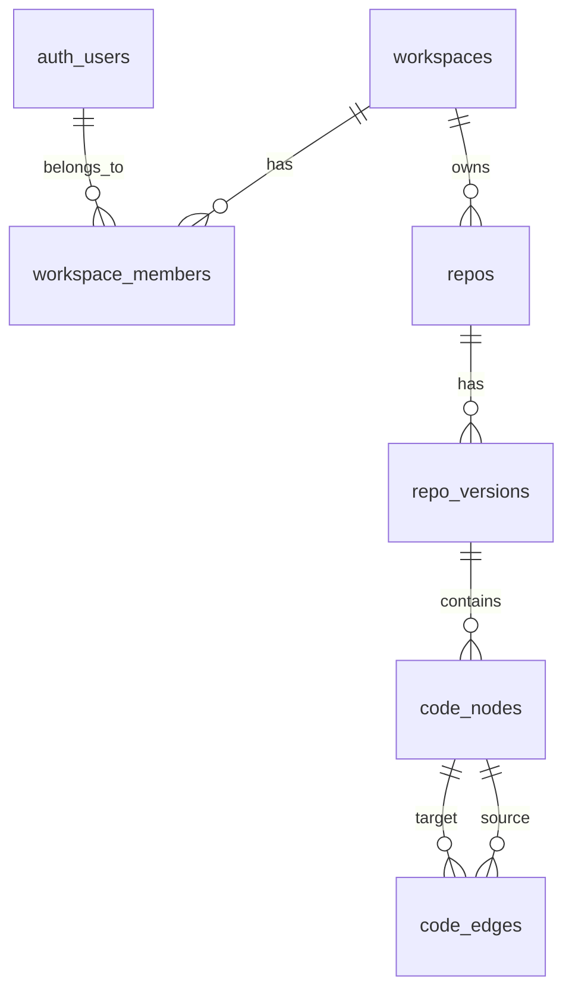

# Monoid Core Data Model and Ingestion Pipeline

## Architecture Overview



## Migration 1: `create_workspaces_and_members`

Creates the multi-tenant foundation:

```sql
-- Workspaces: tenant isolation boundary
CREATE TABLE public.workspaces (
  id uuid PRIMARY KEY DEFAULT gen_random_uuid(),
  name text NOT NULL,
  slug text UNIQUE NOT NULL,
  created_at timestamptz DEFAULT now(),
  updated_at timestamptz DEFAULT now()
);

-- Workspace members: links auth.users to workspaces
CREATE TABLE public.workspace_members (
  id uuid PRIMARY KEY DEFAULT gen_random_uuid(),
  workspace_id uuid NOT NULL REFERENCES public.workspaces(id) ON DELETE CASCADE,
  user_id uuid NOT NULL REFERENCES auth.users(id) ON DELETE CASCADE,
  role text NOT NULL DEFAULT 'member' CHECK (role IN ('owner', 'admin', 'member')),
  created_at timestamptz DEFAULT now(),
  UNIQUE(workspace_id, user_id)
);
```

## Migration 2: `create_repos_and_versions`

Creates the repository and commit snapshot models:

```sql
-- Repos: GitHub repositories linked to workspaces
CREATE TABLE public.repos (
  id uuid PRIMARY KEY DEFAULT gen_random_uuid(),
  workspace_id uuid NOT NULL REFERENCES public.workspaces(id) ON DELETE CASCADE,
  owner text NOT NULL,       -- GitHub owner (org or user)
  name text NOT NULL,        -- GitHub repo name
  default_branch text DEFAULT 'main',
  created_at timestamptz DEFAULT now(),
  updated_at timestamptz DEFAULT now(),
  UNIQUE(workspace_id, owner, name)
);

-- Repo versions: commit snapshots
CREATE TABLE public.repo_versions (
  id uuid PRIMARY KEY DEFAULT gen_random_uuid(),
  repo_id uuid NOT NULL REFERENCES public.repos(id) ON DELETE CASCADE,
  commit_sha text NOT NULL,
  branch text,
  committed_at timestamptz,
  ingested_at timestamptz DEFAULT now(),
  node_count integer DEFAULT 0,
  edge_count integer DEFAULT 0,
  UNIQUE(repo_id, commit_sha)
);
```

## Migration 3: `create_code_nodes`

Creates the AST-derived code node table:

```sql
-- Node type enum for semantic classification
CREATE TYPE public.node_type AS ENUM (
  'function', 'class', 'method', 'endpoint', 'handler',
  'middleware', 'hook', 'component', 'module', 'variable',
  'type', 'interface', 'constant', 'test', 'other'
);

-- Code nodes: AST-derived semantic units
CREATE TABLE public.code_nodes (
  id uuid PRIMARY KEY DEFAULT gen_random_uuid(),
  version_id uuid NOT NULL REFERENCES public.repo_versions(id) ON DELETE CASCADE,
  
  -- Identity
  stable_id text NOT NULL,        -- Hash-based ID for cross-commit tracking
  name text NOT NULL,             -- Symbol name (e.g., "getUserById")
  qualified_name text,            -- Full path (e.g., "UserService.getUserById")
  
  -- Classification
  node_type public.node_type NOT NULL,
  language text,                  -- "typescript", "python", etc.
  
  -- Location
  file_path text NOT NULL,
  start_line integer NOT NULL,
  start_column integer,
  end_line integer NOT NULL,
  end_column integer,
  
  -- Content
  snippet text,                   -- First ~500 chars of code
  signature text,                 -- Function signature or class declaration
  
  -- Metadata
  metadata jsonb DEFAULT '{}',    -- Language-specific extras
  created_at timestamptz DEFAULT now(),
  
  UNIQUE(version_id, stable_id)
);
```

## Migration 4: `create_code_edges`

Creates the graph relationship table:

```sql
-- Edge type enum for relationship classification
CREATE TYPE public.edge_type AS ENUM (
  'calls', 'imports', 'exports', 'extends', 'implements',
  'routes_to', 'depends_on', 'uses', 'defines', 'references', 'other'
);

-- Code edges: graph relationships between nodes
CREATE TABLE public.code_edges (
  id uuid PRIMARY KEY DEFAULT gen_random_uuid(),
  version_id uuid NOT NULL REFERENCES public.repo_versions(id) ON DELETE CASCADE,
  source_node_id uuid NOT NULL REFERENCES public.code_nodes(id) ON DELETE CASCADE,
  target_node_id uuid NOT NULL REFERENCES public.code_nodes(id) ON DELETE CASCADE,
  
  edge_type public.edge_type NOT NULL,
  weight integer DEFAULT 1,       -- For ranking importance
  metadata jsonb DEFAULT '{}',    -- Additional context
  created_at timestamptz DEFAULT now(),
  
  UNIQUE(version_id, source_node_id, target_node_id, edge_type)
);
```

## Migration 5: `create_indexes`

Performance indexes for common query patterns:

```sql
-- Workspace member lookups (for RLS)
CREATE INDEX idx_workspace_members_user_id ON public.workspace_members(user_id);
CREATE INDEX idx_workspace_members_workspace_id ON public.workspace_members(workspace_id);

-- Repo lookups
CREATE INDEX idx_repos_workspace_id ON public.repos(workspace_id);

-- Version lookups
CREATE INDEX idx_repo_versions_repo_id ON public.repo_versions(repo_id);
CREATE INDEX idx_repo_versions_commit_sha ON public.repo_versions(commit_sha);

-- Node lookups (most critical for performance)
CREATE INDEX idx_code_nodes_version_id ON public.code_nodes(version_id);
CREATE INDEX idx_code_nodes_file_path ON public.code_nodes(file_path);
CREATE INDEX idx_code_nodes_stable_id ON public.code_nodes(stable_id);
CREATE INDEX idx_code_nodes_node_type ON public.code_nodes(node_type);
CREATE INDEX idx_code_nodes_version_file ON public.code_nodes(version_id, file_path);

-- Edge lookups (critical for graph traversal)
CREATE INDEX idx_code_edges_version_id ON public.code_edges(version_id);
CREATE INDEX idx_code_edges_source ON public.code_edges(source_node_id);
CREATE INDEX idx_code_edges_target ON public.code_edges(target_node_id);
CREATE INDEX idx_code_edges_type ON public.code_edges(edge_type);
```

## Migration 6: `create_rls_policies`

Row Level Security for multi-tenant isolation:

```sql
-- Enable RLS on all tables
ALTER TABLE public.workspaces ENABLE ROW LEVEL SECURITY;
ALTER TABLE public.workspace_members ENABLE ROW LEVEL SECURITY;
ALTER TABLE public.repos ENABLE ROW LEVEL SECURITY;
ALTER TABLE public.repo_versions ENABLE ROW LEVEL SECURITY;
ALTER TABLE public.code_nodes ENABLE ROW LEVEL SECURITY;
ALTER TABLE public.code_edges ENABLE ROW LEVEL SECURITY;

-- Helper function: check workspace membership
CREATE OR REPLACE FUNCTION public.user_has_workspace_access(ws_id uuid)
RETURNS boolean AS $$
  SELECT EXISTS (
    SELECT 1 FROM public.workspace_members
    WHERE workspace_id = ws_id AND user_id = auth.uid()
  );
$$ LANGUAGE sql SECURITY DEFINER STABLE;

-- Workspaces: users can see workspaces they belong to
CREATE POLICY workspaces_select ON public.workspaces
  FOR SELECT USING (public.user_has_workspace_access(id));

CREATE POLICY workspaces_insert ON public.workspaces
  FOR INSERT WITH CHECK (true);  -- Anyone can create, they become owner

CREATE POLICY workspaces_update ON public.workspaces
  FOR UPDATE USING (public.user_has_workspace_access(id));

-- Workspace members: users can see members of their workspaces
CREATE POLICY workspace_members_select ON public.workspace_members
  FOR SELECT USING (public.user_has_workspace_access(workspace_id));

CREATE POLICY workspace_members_insert ON public.workspace_members
  FOR INSERT WITH CHECK (public.user_has_workspace_access(workspace_id));

-- Repos: scoped to workspace
CREATE POLICY repos_select ON public.repos
  FOR SELECT USING (public.user_has_workspace_access(workspace_id));

CREATE POLICY repos_all ON public.repos
  FOR ALL USING (public.user_has_workspace_access(workspace_id));

-- Repo versions: access via repo -> workspace chain
CREATE POLICY repo_versions_select ON public.repo_versions
  FOR SELECT USING (
    EXISTS (
      SELECT 1 FROM public.repos r
      WHERE r.id = repo_id AND public.user_has_workspace_access(r.workspace_id)
    )
  );

CREATE POLICY repo_versions_all ON public.repo_versions
  FOR ALL USING (
    EXISTS (
      SELECT 1 FROM public.repos r
      WHERE r.id = repo_id AND public.user_has_workspace_access(r.workspace_id)
    )
  );

-- Code nodes: access via version -> repo -> workspace chain
CREATE POLICY code_nodes_select ON public.code_nodes
  FOR SELECT USING (
    EXISTS (
      SELECT 1 FROM public.repo_versions rv
      JOIN public.repos r ON r.id = rv.repo_id
      WHERE rv.id = version_id AND public.user_has_workspace_access(r.workspace_id)
    )
  );

CREATE POLICY code_nodes_all ON public.code_nodes
  FOR ALL USING (
    EXISTS (
      SELECT 1 FROM public.repo_versions rv
      JOIN public.repos r ON r.id = rv.repo_id
      WHERE rv.id = version_id AND public.user_has_workspace_access(r.workspace_id)
    )
  );

-- Code edges: same chain as nodes
CREATE POLICY code_edges_select ON public.code_edges
  FOR SELECT USING (
    EXISTS (
      SELECT 1 FROM public.repo_versions rv
      JOIN public.repos r ON r.id = rv.repo_id
      WHERE rv.id = version_id AND public.user_has_workspace_access(r.workspace_id)
    )
  );

CREATE POLICY code_edges_all ON public.code_edges
  FOR ALL USING (
    EXISTS (
      SELECT 1 FROM public.repo_versions rv
      JOIN public.repos r ON r.id = rv.repo_id
      WHERE rv.id = version_id AND public.user_has_workspace_access(r.workspace_id)
    )
  );
```

## Migration 7: `create_helper_functions`

Utility functions for GitHub permalinks and graph traversal:

```sql
-- Generate GitHub permalink for a code node
CREATE OR REPLACE FUNCTION public.github_permalink(
  p_owner text,
  p_name text,
  p_commit_sha text,
  p_file_path text,
  p_start_line integer,
  p_end_line integer DEFAULT NULL
)
RETURNS text AS $$
BEGIN
  IF p_end_line IS NOT NULL AND p_end_line != p_start_line THEN
    RETURN format(
      'https://github.com/%s/%s/blob/%s/%s#L%s-L%s',
      p_owner, p_name, p_commit_sha, p_file_path, p_start_line, p_end_line
    );
  ELSE
    RETURN format(
      'https://github.com/%s/%s/blob/%s/%s#L%s',
      p_owner, p_name, p_commit_sha, p_file_path, p_start_line
    );
  END IF;
END;
$$ LANGUAGE plpgsql IMMUTABLE;

-- Recursive downstream traversal (blast radius)
CREATE OR REPLACE FUNCTION public.get_downstream_nodes(
  p_node_id uuid,
  p_max_depth integer DEFAULT 5
)
RETURNS TABLE(
  node_id uuid,
  depth integer,
  path uuid[]
) AS $$
WITH RECURSIVE downstream AS (
  -- Base case: starting node
  SELECT 
    e.target_node_id as node_id,
    1 as depth,
    ARRAY[e.source_node_id, e.target_node_id] as path
  FROM public.code_edges e
  WHERE e.source_node_id = p_node_id
  
  UNION
  
  -- Recursive case: follow edges
  SELECT 
    e.target_node_id,
    d.depth + 1,
    d.path || e.target_node_id
  FROM downstream d
  JOIN public.code_edges e ON e.source_node_id = d.node_id
  WHERE d.depth < p_max_depth
    AND NOT e.target_node_id = ANY(d.path)  -- Prevent cycles
)
SELECT DISTINCT ON (node_id) * FROM downstream
ORDER BY node_id, depth;
$$ LANGUAGE sql STABLE;
```

## Example Queries

### Fetch nodes by file and version

```sql
SELECT n.*, public.github_permalink(r.owner, r.name, rv.commit_sha, n.file_path, n.start_line, n.end_line) as permalink
FROM public.code_nodes n
JOIN public.repo_versions rv ON rv.id = n.version_id
JOIN public.repos r ON r.id = rv.repo_id
WHERE rv.commit_sha = 'abc123'
  AND n.file_path = 'src/services/user.ts';
```

### Traverse downstream dependencies (blast radius)

```sql
SELECT 
  d.depth,
  n.name,
  n.node_type,
  n.file_path,
  n.start_line
FROM public.get_downstream_nodes('node-uuid-here', 3) d
JOIN public.code_nodes n ON n.id = d.node_id
ORDER BY d.depth, n.file_path;
```

## Execution Plan

I will apply these as 7 separate migrations to your Supabase project, which allows for:

- Clean rollback boundaries
- Logical grouping of related DDL
- Easier debugging if issues arise